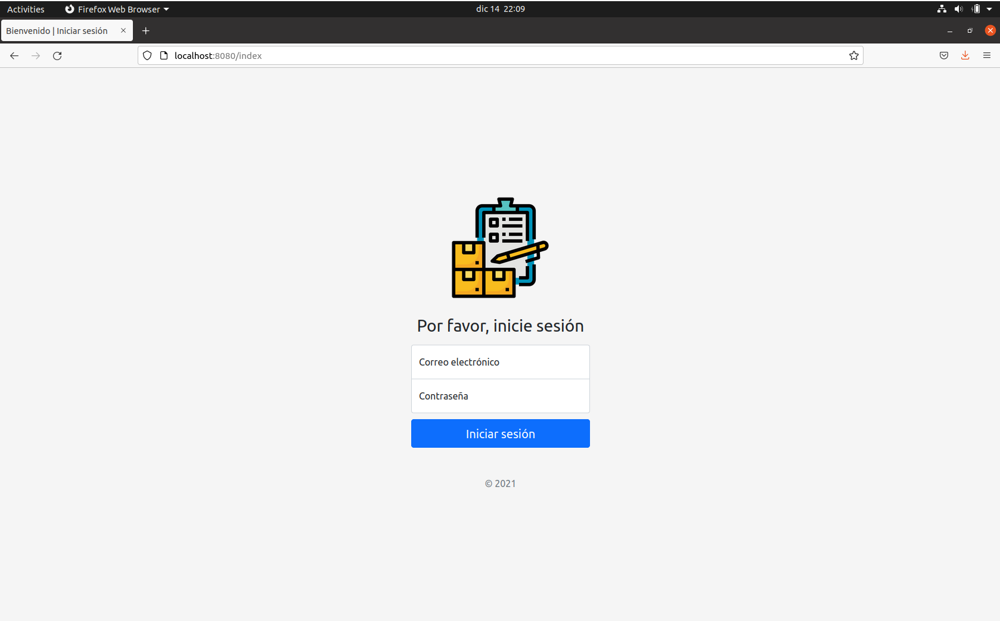
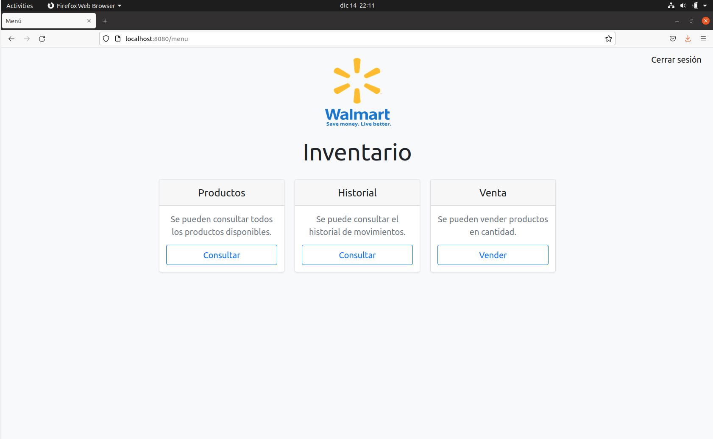
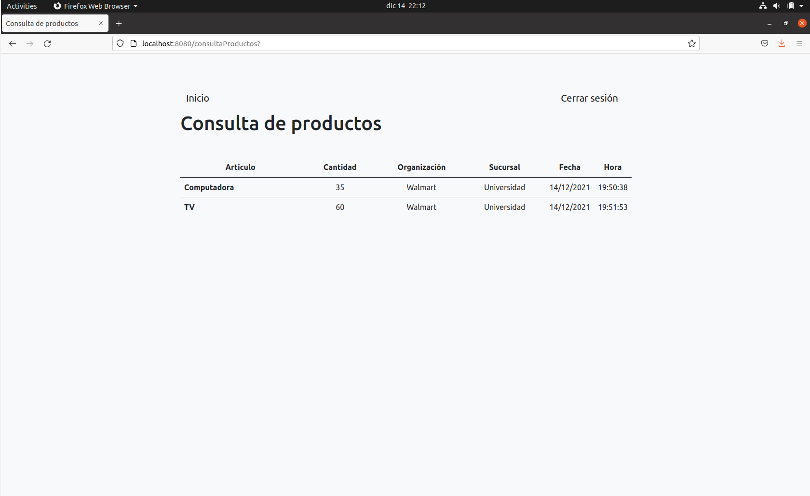
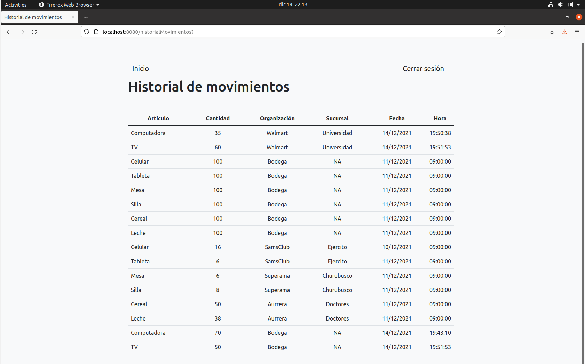
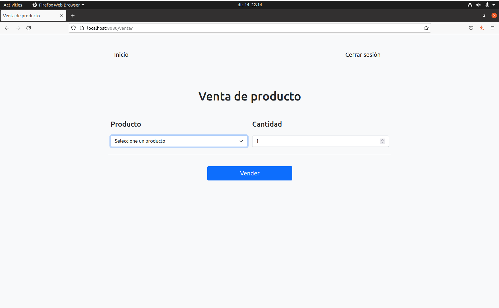
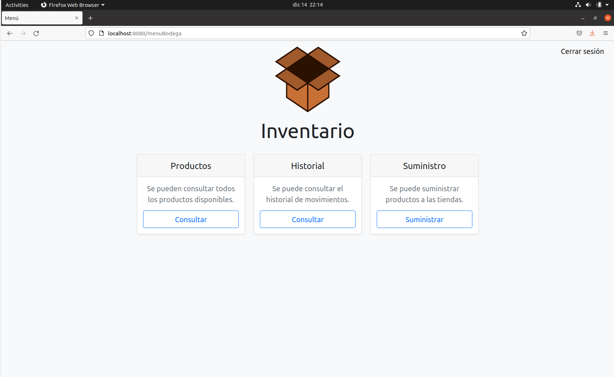
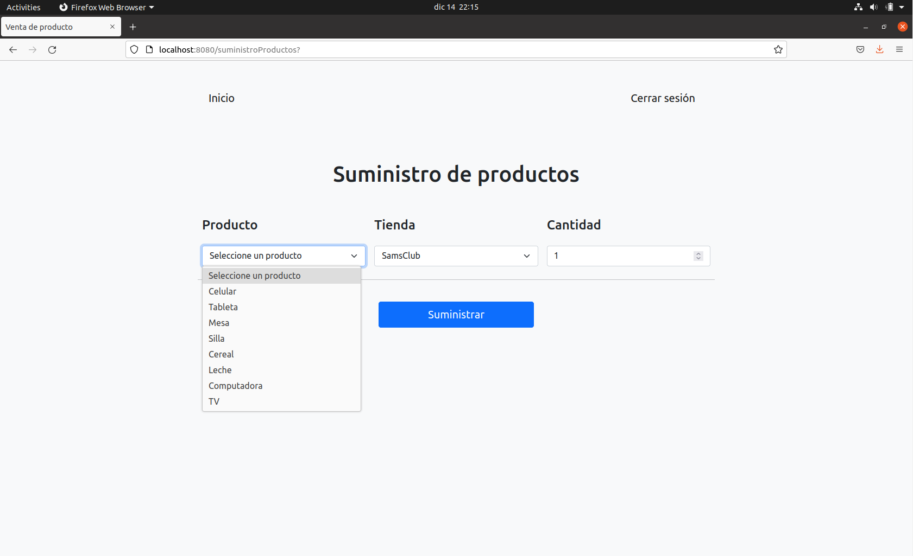

# Proyecto final de Criptografía 

## Inventario de una cadena de tiendas utilizando blockchain
### Integrantes
- Cabrera Beltrán Héctor Eduardo
- Castelan Hernández Mario
- López Chong Samanta Lizbeth

## Requisitos
- La última versión de Git
- La última versión de cURL
- La última versión de Docker y Docker Compose
- La versión 2.3.3 de Fabric y la 1.5.2 de Fabric CA
`curl -sSL https://bit.ly/2ysbOFE | bash -s -- 2.3.3 1.5.2`

## Instrucciones
1. Bajar o clonar el repositorio: `git clone https://github.com/Hec42/Inventario-Blockchain.git`
2. Situarse en el directorio  `./Inventario-Blockchain/fabcar/`
3. Iniciar la red de Fabric con el script [`./startFabric.sh javascript`](./fabcar/startFabric.sh)
4. Situarse en el directorio  `./Inventario-Blockchain/fabcar/javascript/`
5. Instalar las dependencias con `npm install`
6. Inscribir los administradores [`node enrollAdmin.js`](./fabcar/javascript/enrollAdmin.js)
7. Registrar a los usuarios [`node registerUser.js`](./fabcar/javascript/registerUser.js)
8. Iniciar el servidor de Express JS [`node app.js`](./fabcar/javascript/app.js)
10. La página web se puede visitar a través de un navegador con la siguiente dirección `http://localhost:8080/`

>Nota:
En caso de obtener un error al iniciar la red con `./startFabric.sh javascript`, es recomendable copiar las carpetas del proyecto descargado a la carpeta de `fabric-samples` de su instalación, el administrador de archivos le preguntará si desea remplazar los archivos, por lo cual deberá de aceptar que se remplace para todos.

## Referencias a código de la aplicación
- [`Chaincode`](./chaincode/fabcar/javascript/lib/fabcar.js)
- [`Servidor Express`](./fabcar/javascript/app.js)

## Algunas imágenes de la aplicación

**Inicio de sesión**

**Menú de la sucursal Walmart**

**Consulta de productos**

**Consulta de Historial**

**Venta de producto**

**Menú de la bodega**

**Suministro de productos**

